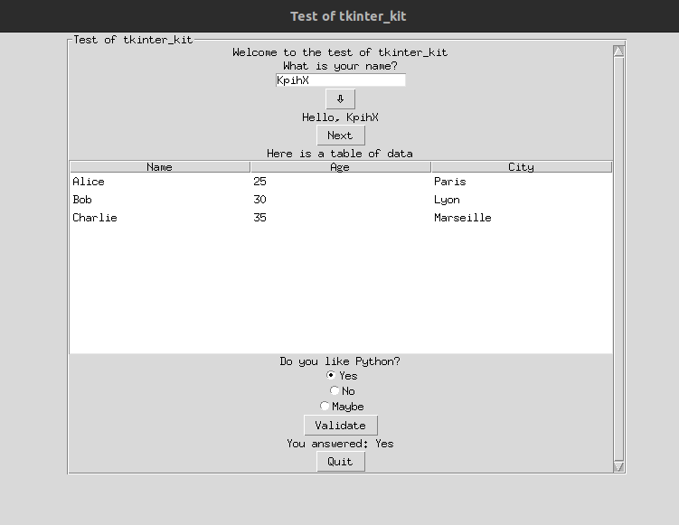

# TKinter-Kit ⏱️

This project aims to provide a rich set of helpful functions, to easily use the tkinter module, to have a better graphical user interface experience

## Features 💡

* It contains functions to easily interact with users as simple as the  print()  and input() functions
* It helps to manage scroll_bar easily
* It helps to have a better experience when printing 2D tables

## Examples of use 📝

```python
#!/usr/bin/env python3
# -*-coding:UTF-8 -*

import tkinter as tk
import tkinter_kit.func as tkk

# We create a main window
window = tk.Tk(className=" Test of tkinter_kit")

# We create a canvas and a frame to add a vertical scrollbar
canvas = tk.Canvas(window, width = 1000, height=830)
frame = tk.LabelFrame(canvas, width=1000, height=830, text="Test of tkinter_kit")
scrollbar = tkk.frame_vertical_scrollbar(window, canvas, frame)

# We create a label to display a message
tkk.print_window(frame, "Welcome to the test of tkinter_kit")

# We create an entry to ask the user's name
name = tkk.input_window(window, frame, "What is your name?")

# We create a label to display the user's name
tkk.print_window(frame, "Hello, " + name)

tkk.next_button(window, frame, text="Next")

# We create a list of data to display a table
Heading = ["Name", "Age", "City"]
Datas = [["Alice", 25, "Paris"], ["Bob", 30, "Lyon"], ["Charlie", 35, "Marseille"]]

# We create a label to display the title of the table
tkk.print_window(frame, "Here is a table of data")

# We create a table to display the data
tkk.print_table_windows(frame, Heading, Datas)

# We create a list of possible answers
RESPONSES = ["Yes", "No", "Maybe"]

# We create a label to display a question
tkk.print_window(frame, "Do you like Python?")

# We create radio buttons to display the possible answers
value = tk.StringVar()
button1 = tk.Radiobutton(frame, text="Yes", variable=value, value=RESPONSES[0])
button2 = tk.Radiobutton(frame, text="No", variable=value, value=RESPONSES[1])
button3 = tk.Radiobutton(frame, text="Maybe", variable=value, value=RESPONSES[2])
button1.pack()
button2.pack()
button3.pack()

# We create a button to validate the answer
tkk.next_button(window, frame, text="Validate")

# We create a label to display the user's answer
tkk.print_window(frame, "You answered: " + value.get())

# We create a button to quit the window
tkk.leave_window(window, frame, text="Quit")

```

We obtain this result :



## Author ✍️

This project was created by KpihX. You can contact me at kapoivha@gmail.com for any questions or suggestions.

## License 📄

This project is licensed under the MIT license - see the LICENSE file for more details.

: https://github.com/KpihX
